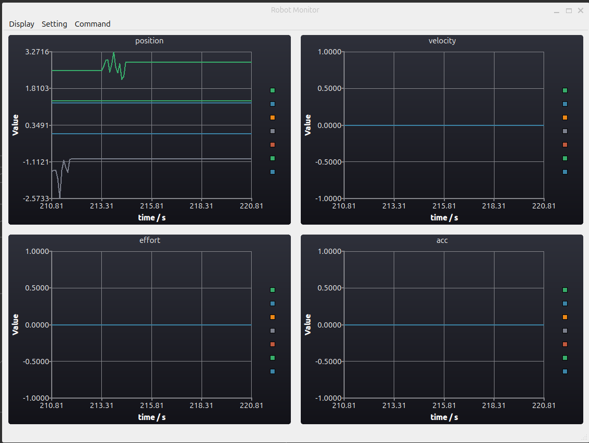

# ros2_robot_control

This is our lab code repository for robot control using ros2. Of course you have to install ROS2 and ros2_control first. The codes are developed under Ubuntu 24 with ROS2 Jazzy.

# package dependencies

Please clone the following packages into the src folder of your ros2's workspace. (e.g., ~/ros2_ws)

1. franka_description (https://github.com/frankaemika/franka_description.git)

# build from source

1. install dependencies

   ```bash
   sudo apt install qt6-base-dev
   ```
2. sudo apt install qt6-base-dev`
3. go to your workspace's src folder and clone & build the source

   ```bash
   cd ~/ros2_ws/src
   git clone https://github.com/JunchenWang/ros2_robot_control.git
   colcon build --cmake-args -DCMAKE_BUILD_TYPE=Release --symlink-install
   ```
4. launch the monitor test

   ```bash
   source ~/ros2_ws/install/local_setup.bash
   ros2 launch robot_monitor robot_monitor_launch.py
   ```

# package list

This repository contains the following packages:

### 1. robot_monitor

It is a gui interface which can display the real-time curves of joint states (position, velocity, effort, acceleration) published on the topic of "joint_states".



You can run **robot_monitor** as a standalone node to visualize the robot's states.

```bash
ros2 run robot_monitor robot_monitor
```

before that, do not forget to source the path

```bash
source ~/ros2_ws/install/local_setup.bash
```

### 2. continue...
